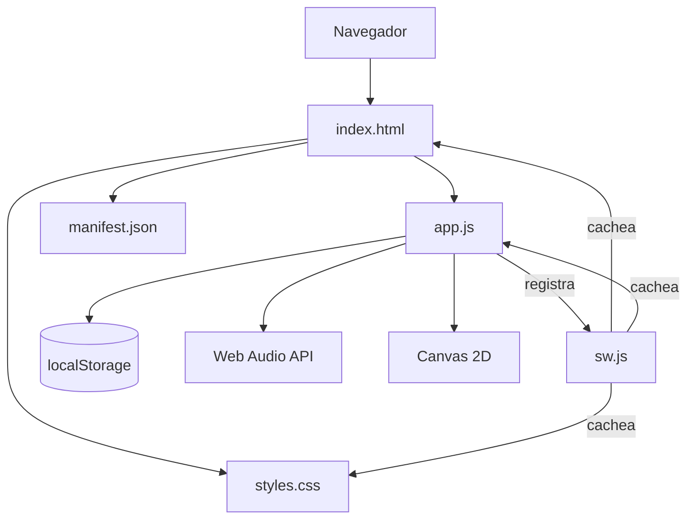
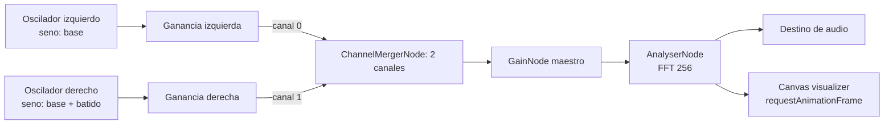
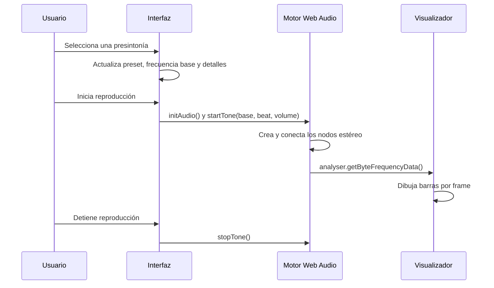
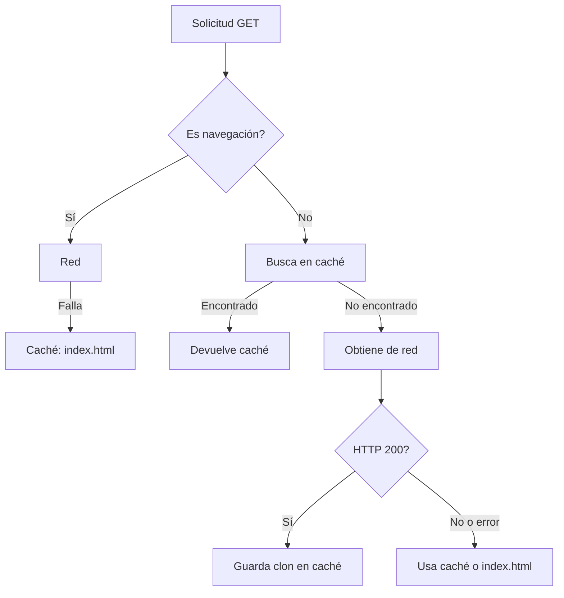

# Binaural Beats Pro: documentación técnica

`app/` es una aplicación web estática, sin dependencias ni servidor de aplicación. Su punto de entrada es `index.html`; `app.js` concentra el estado, el motor Web Audio, la interacción de interfaz y la persistencia local.

## Componentes

| Archivo | Responsabilidad |
| --- | --- |
| `index.html` | Estructura de vistas: presintonías, reproductor, editor, sesiones, información y ajustes. Carga el manifiesto, estilos y script. |
| `app.js` | Traducciones, temas, presintonías, síntesis de audio, visualizador, editor de curvas, gestión de sesiones y eventos de UI. |
| `styles.css` | Diseño responsive, variables de tema y estilos de todos los estados visuales. |
| `manifest.json` | Metadatos de instalación, alcance `./`, modo `standalone`, orientación vertical e iconos. |
| `sw.js` | Instalación, activación, invalidación de cachés previas y estrategia offline. |

## Arquitectura



## Modelo de audio

El motor se crea de forma diferida en `initAudio()`, después de una interacción del usuario compatible con las políticas de reproducción automática del navegador. Se conservan referencias globales al contexto y los nodos activos para detener o modificar una sesión.



Para un preset, la relación de frecuencias es:

$$
f_L = f_b \qquad f_R = f_b + f_\Delta
$$

`startTone(baseFreq, beatFreq, volume)` crea dos osciladores sinusoidales y asigna cada uno a un canal distinto del `ChannelMergerNode`. Durante una reproducción activa, el control de frecuencia base actualiza ambos osciladores. El control de volumen modifica el `GainNode` maestro.

`stopTone()` detiene y desconecta los osciladores, cancela la animación del visualizador y restablece el estado de reproducción personalizada.

## Flujos de reproducción

### Presintonía



### Sesión personalizada

El lienzo del editor mantiene puntos normalizados `{ x, y }`:

- `x`: posición temporal normalizada en el intervalo $[0, 1]$.
- `y`: frecuencia de batido normalizada en el intervalo $[0, 1]$.
- `MAX_BEAT`: 40 Hz.

Para cada punto, la programación del oscilador derecho calcula:

$$
t_i = t_0 + x_i \cdot D \qquad f_{R,i} = f_b + y_i \cdot 40
$$

donde $D$ es la duración configurada. Los puntos se ordenan por `x` y se programan mediante `setValueAtTime`. Por tanto, entre puntos el valor se mantiene hasta el siguiente cambio programado; no se aplica interpolación lineal. La sesión se detiene con un `setTimeout` al cumplirse la duración.

## Estado y persistencia

El estado de ejecución es efímero y reside en variables de módulo: `audioCtx`, osciladores, nodos de audio, `isPlaying`, `currentPreset`, `points` y datos de reproducción personalizada. No existe un store externo.

| Clave de `localStorage` | Tipo | Contenido |
| --- | --- | --- |
| `bb_language` | cadena | `es` o `en`. |
| `bb_theme` | cadena | `dark`, `light`, `monokai`, `desert`, `ocean` o `solarized`. |
| `bb_saved` | JSON | Matriz de programas personalizados. |

Cada elemento de `bb_saved` tiene la forma:

```json
{
  "id": 1710000000000,
  "name": "Mi programa",
  "points": [{ "x": 0, "y": 0.25 }, { "x": 1, "y": 0.5 }],
  "duration": 60,
  "base": 200,
  "created": 1710000000000
}
```

Las operaciones guardar, cargar, reproducir y eliminar actúan directamente sobre esa matriz. No hay sincronización entre navegadores, perfiles ni dispositivos.

## Internacionalización y temas

`TRANSLATIONS` contiene los textos español e inglés. `translateStatic()` procesa elementos con `data-i18n`, actualiza `lang`, sincroniza los botones de idioma y ajusta etiquetas ARIA relacionadas.

`setTheme()` valida el tema, conmuta las clases de `body` y persiste la selección. El tema por defecto usa `prefers-color-scheme` cuando no existe una preferencia guardada.

## PWA y comportamiento offline

Al arrancar, `app.js` registra `./sw.js` si el navegador admite service workers. El worker usa la caché `binaural-beats-pro-v6`.



Durante `install`, el worker precachea `./`, `./index.html`, `./styles.css` y `./app.js`; durante `activate`, elimina cualquier caché con otro nombre. Las solicitudes de recursos no presentes inicialmente se guardan tras una respuesta HTTP 200. Para registrar el worker se necesita un origen seguro: HTTPS o `localhost` durante desarrollo.

## Desarrollo y comprobaciones manuales

Sirve el directorio raíz con un servidor HTTP y navega a `/app/`:

```powershell
cd c:\proyectos\scaamanho\binauralbeatspro
py -m http.server 8080
```

Comprobaciones recomendadas:

1. Confirma que una presintonía separa el audio por los canales izquierdo y derecho usando auriculares.
2. Crea una sesión de al menos dos puntos y verifica que se detiene al terminar la duración.
3. Guarda, carga, reproduce y elimina una sesión; revisa `localStorage.bb_saved` en DevTools.
4. Cambia idioma y tema, recarga y verifica la persistencia.
5. En DevTools, verifica el service worker y prueba el modo offline tras una primera carga correcta.

## Límites conocidos

- La reproducción depende de Web Audio API y de que el navegador permita iniciar audio tras una interacción.
- Las sesiones personalizadas usan cambios escalonados; el editor no suaviza la transición entre puntos.
- Los programas se almacenan sólo en el navegador local y pueden perderse al limpiar datos del sitio.
- La aplicación produce tonos, no mide actividad cerebral ni ofrece diagnóstico, tratamiento o resultados clínicos.
